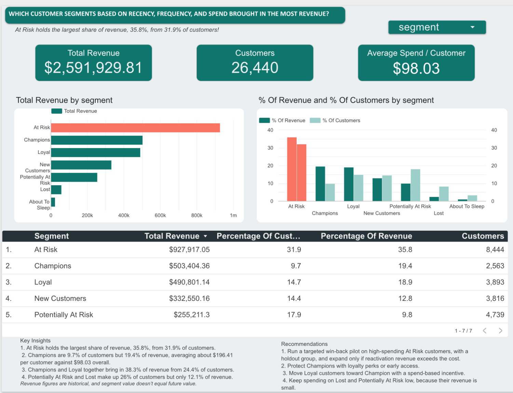
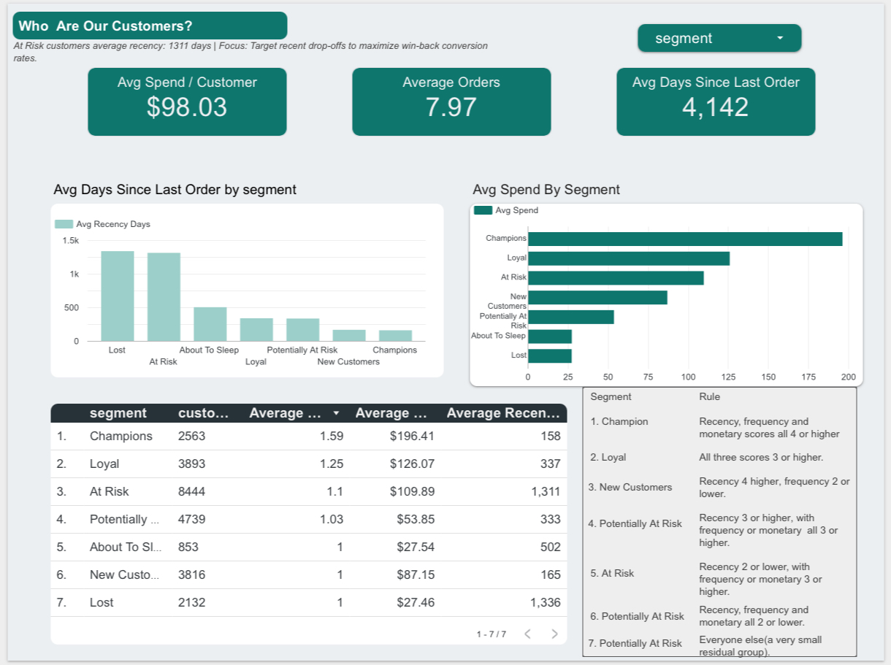
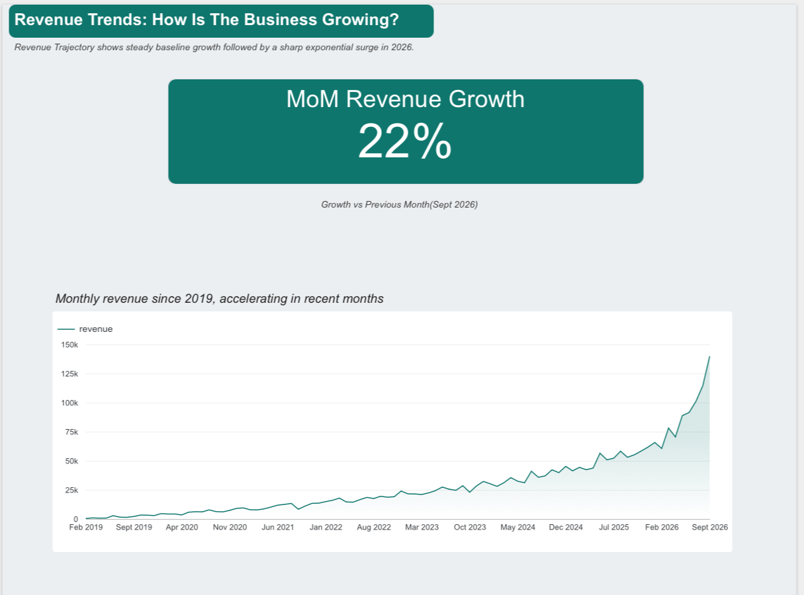

# Customer Segmentation  Using Recency Frequency Monetary (RFM) Analysis
An RFM (Recency, Frequency, Monetary) customer segmentation built in BigQuery SQL and presented in an interactive Data Studio dashboard. The project shows which customer segments bring in the most revenue and where a retail business should focus its retention efforts.

## Live Dashboard: [View Dashboard](https://datastudio.google.com/reporting/a0064c39-911c-42a5-a984-615ddbc2ee84)

## Business Question 
Which customer segments, based on how recently, how often and how much they buy, bring in the most revenue?

## Dataset
- Source: bigquery-public-data.thelook_ecommerce (a public, synthetic e-commerce dataset)
	∙
- Table used: order_items
- Columns used: user_id, order_id, created_at, sale_price, status
- Scope: completed orders only (cancelled, returned, shipped and processing items excluded).
  
## Method
1.	Cleaned the orders. Kept only items with status Complete.
2.	Calculated RFM per customer:
  - Recency: days between the customer’s last order and a fixed reference date (the day after the last order in the dataset)
- Frequency: number of distinct orders
- Monetary: total spend
  
3.	Scored each measure from 1 to 5 with NTILE(5), where 5 is best.
4.	Assigned segments with CASE WHEN rules on the three scores.
5.	Summarised by segment: customers, revenue, average spend, average recency and average orders, plus each segment’s share of customers and revenue.
6.	Built the dashboard in Data Studio from the final query.
   
## Segment Definitions

| Segment | Rule |
|-| -|
| Champion | Recency, frequency, monetary scores all 4 or higher|
| Loyal | All three scores 3 or higher|
| New Customers | Recency 4 or higher, frequency 2 or lower|
| Potentially At Risk | Recency 3 or higher, with frequency or monetary 3 or higher|
| At Risk | Recency 2 or lower, with frequency or monetary 3 or higher|
| Lost | Recency, frequency, monetary scores all 2 or lower|
| About To Sleep | Everyone else, a very small residual group|

## Key Findings
- The analysis covers 26,440 customers and $2,591,929.81 in revenue, an average of about $98.03 per customer.
- At Risk is the largest revenue segment: 35.8% of revenue from 31.9% of customers.
- Champions are 9.7% of customers but 19.4% of revenue.
- Champions and Loyal together bring in about 38.3% of revenue from about 24.4 % of customers.
- Potentially At Risk and Lost make up about 26% of customers but only about 12.1% of revenue.
  
## Recommendations
1. Run a targeted win-back pilot on high-spending At Risk customers. Keep a holdout group that gets no offer, and expand only if the extra revenue exceeds the cost of the offer.
2.	At Risk customers average recency: 1311 days | Focus: Target recent drop-offs to maximize win-back conversion rates.
3.	Protect Champions with loyalty perks or early access.
4.	Move Loyal customers toward Champion status with a spend-based incentive.
5.	Keep spending on Lost and Potentially At Risk customers low, since their revenue is small.
   
## Limitations
- Revenue is historical. A segment’s past revenue shows who used to spend, not guaranteed future revenue.
- Most customers have only one order, so many tie on frequency and NTILE splits the ties somewhat arbitrarily. Segment boundaries are approximate.
- The score cutoffs (3 and 4) are judgment calls, and different cutoffs would change segment sizes.
- The data is synthetic, so results illustrate the method and are not real business findings.
- Revenue is not profit. Discount costs and margins were not available.
  
## Tools Used
- Google BigQuery (SQL, CTEs, window functions)
- Data Studio / Looker Studio (dashboard)
- GitHub (documentation)
